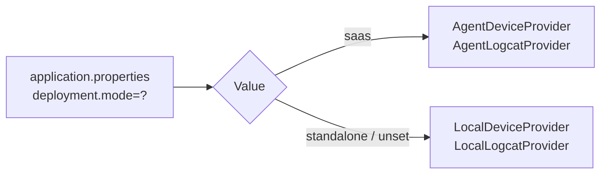

# Design Document: Agent Device Relay

## Overview

The Agent Device Relay feature introduces a deployment-mode-aware abstraction layer that allows the backend to serve device data and execute device commands regardless of whether Android devices are locally connected (standalone/desktop mode) or remotely connected via agent processes (SaaS mode).

In **standalone mode**, the existing direct `adb` path continues unchanged — `DeviceCatalog` discovers devices and `DeviceActionManager` executes commands locally.

In **SaaS mode**, the backend runs in Docker on Azure without USB access. Instead, agent processes on client machines report device state via WebSocket (`AgentMessage.DeviceList`) and execute commands on behalf of the backend (`AgentCommand`). The backend maintains a registry of connected agents and their devices, relays commands to the appropriate agent, and forwards real-time data (logcat streams) to frontend clients.

The frontend remains completely agnostic to the device data source — it always talks to the same REST endpoints and subscribes to the same WebSocket topics.

### Key Design Decisions

1. **Strategy Pattern via `DeviceProvider` interface** — A single interface abstracts device discovery and command execution. Spring's `@ConditionalOnProperty` selects the implementation at startup based on `deployment.mode`.

2. **Existing classes remain unchanged** — `DeviceCatalog`, `DeviceActionManager`, and `DeviceMonitorService` are not modified. Instead, the new `DeviceProvider` wraps them (standalone) or replaces their role (SaaS).

3. **CompletableFuture for command relay** — In SaaS mode, commands are sent to agents and a `CompletableFuture` is registered keyed by `requestId`. When the agent responds with `OperationResult`, the future is completed. Timeouts are enforced via `orTimeout(30, SECONDS)`.

4. **Per-agent device registry with tenant scoping** — `AgentConnectionManager` maintains a `Map<agentId, Set<DeviceInfo>>` and provides tenant-filtered views. Device changes trigger broadcasts only to the affected tenant's WebSocket subscribers.

## Architecture

```mermaid
graph TB
    subgraph "Frontend (React)"
        UI[Dashboard UI]
    end

    subgraph "Backend (Spring Boot)"
        DC[DeviceController<br/>/api/devices]
        DMS[DeviceMonitorService]
        DP{DeviceProvider}
        LDP[LocalDeviceProvider]
        ADP[AgentDeviceProvider]
        ACM[AgentConnectionManager]
        CR[CommandRelay]
        AWSH[AgentWebSocketHandler]
        STOMP[STOMP Broker<br/>/topic/devices<br/>/topic/logcat/{serial}]
    end

    subgraph "Agent (Client Machine)"
        AG[Agent Process]
        ADB[adb]
        DEV[Android Devices]
    end

    UI -->|REST| DC
    UI -->|STOMP subscribe| STOMP
    DC --> DP
    DMS --> DP
    DP -->|standalone| LDP
    DP -->|saas| ADP
    LDP -->|direct adb| ADB
    ADP --> ACM
    ADP --> CR
    CR --> AWSH
    AWSH -->|WebSocket| AG
    AG --> ADB
    ADB --> DEV
    ACM -->|device state| STOMP
    AWSH -->|logcat lines| STOMP
```

### Deployment Mode Selection



## Components and Interfaces

### DeviceProvider Interface

```java
package androidtoolkit.backend.device;

import androidtoolkit.app.DeviceDiscoveryResult;
import androidtoolkit.app.DeviceMessageResult;
import androidtoolkit.app.UninstallAppResult;
import androidtoolkit.app.ScreenshotCaptureResponse;
import androidtoolkit.app.WifiDebugResult;

/**
 * Abstraction for device discovery and command execution.
 * Implementations are selected based on deployment.mode.
 */
public interface DeviceProvider {

    DeviceDiscoveryResult discoverDevices(Long tenantId);

    DeviceMessageResult reboot(Long tenantId, String serial);

    UninstallAppResult uninstall(Long tenantId, String serial, String packageName);

    ScreenshotCaptureResponse screenshot(Long tenantId, String serial);

    DeviceMessageResult pullLogs(Long tenantId, String serial);

    WifiDebugResult toggleWifiDebug(Long tenantId, String serial,
                                     String ipAddress, boolean wifiDebugSession, boolean hasWifiIp);

    DeviceMessageResult enableFirebaseDebug(Long tenantId, String serial, String packageName);
}
```

### LocalDeviceProvider (standalone mode)

```java
package androidtoolkit.backend.device;

import androidtoolkit.app.*;
import org.springframework.boot.autoconfigure.condition.ConditionalOnProperty;
import org.springframework.stereotype.Component;

@Component
@ConditionalOnProperty(name = "deployment.mode", havingValue = "standalone", matchIfMissing = true)
public class LocalDeviceProvider implements DeviceProvider {

    private final DeviceCatalog deviceCatalog;
    private final DeviceActionManager deviceActionManager;
    private final ScreenshotManager screenshotManager;

    // Constructor injection...

    @Override
    public DeviceDiscoveryResult discoverDevices(Long tenantId) {
        try {
            return deviceCatalog.discoverDevices(new DeviceDiscoveryRequest());
        } catch (RuntimeException e) {
            return new DeviceDiscoveryResult(List.of(), List.of());
        }
    }

    @Override
    public DeviceMessageResult reboot(Long tenantId, String serial) {
        return deviceActionManager.rebootDevice(serial, serial);
    }

    // ... other methods delegate to existing managers
}
```

### AgentDeviceProvider (SaaS mode)

```java
package androidtoolkit.backend.device;

import org.springframework.boot.autoconfigure.condition.ConditionalOnProperty;
import org.springframework.stereotype.Component;

@Component
@ConditionalOnProperty(name = "deployment.mode", havingValue = "saas")
public class AgentDeviceProvider implements DeviceProvider {

    private final AgentConnectionManager connectionManager;
    private final CommandRelay commandRelay;

    // Constructor injection...

    @Override
    public DeviceDiscoveryResult discoverDevices(Long tenantId) {
        return connectionManager.getDevicesForTenant(tenantId);
    }

    @Override
    public DeviceMessageResult reboot(Long tenantId, String serial) {
        return commandRelay.execute(tenantId, serial, new AgentCommand.Reboot(serial));
    }

    // ... other methods relay via CommandRelay
}
```

### CommandRelay

```java
package androidtoolkit.backend.device;

import androidtoolkit.domain.agent.AgentCommand;
import java.util.concurrent.CompletableFuture;
import java.util.concurrent.ConcurrentHashMap;
import java.util.concurrent.TimeUnit;
import java.util.concurrent.TimeoutException;

/**
 * Sends commands to agents and awaits OperationResult responses.
 * Each command is assigned a requestId; the corresponding future is
 * completed when the agent responds or times out after 30 seconds.
 */
@Component
@ConditionalOnProperty(name = "deployment.mode", havingValue = "saas")
public class CommandRelay {

    private final AgentConnectionManager connectionManager;
    private final ConcurrentHashMap<String, CompletableFuture<OperationResult>> pendingCommands
            = new ConcurrentHashMap<>();

    private static final long COMMAND_TIMEOUT_SECONDS = 30;

    public <T> T execute(Long tenantId, String serial, AgentCommand command) {
        String agentId = connectionManager.findAgentForDevice(tenantId, serial)
                .orElseThrow(() -> new DeviceUnreachableException(serial, "No agent connected"));

        String requestId = UUID.randomUUID().toString();
        CompletableFuture<OperationResult> future = new CompletableFuture<>();
        pendingCommands.put(requestId, future);

        try {
            connectionManager.sendToAgent(agentId, command);
            OperationResult result = future.orTimeout(COMMAND_TIMEOUT_SECONDS, TimeUnit.SECONDS).join();
            return mapResult(result);
        } catch (CompletionException e) {
            if (e.getCause() instanceof TimeoutException) {
                throw new CommandTimeoutException(serial, COMMAND_TIMEOUT_SECONDS);
            }
            throw new CommandRelayException(serial, e.getCause().getMessage());
        } finally {
            pendingCommands.remove(requestId);
        }
    }

    /** Called by AgentWebSocketHandler when OperationResult arrives */
    public void completeCommand(String requestId, OperationResult result) {
        CompletableFuture<OperationResult> future = pendingCommands.get(requestId);
        if (future != null) {
            future.complete(result);
        }
    }

    /** Called when an agent disconnects — fail all pending commands for that agent */
    public void failCommandsForAgent(String agentId) {
        // Iterate pending commands and fail those targeting the disconnected agent
    }
}
```

### Enhanced AgentConnectionManager

The existing `AgentConnectionManager` is extended with:

```java
// New methods added to AgentConnectionManager:

/** Replace the device registry for an agent with the new list */
public void updateDeviceList(String agentId, List<DeviceInfo> devices);

/** Get aggregated device list for a tenant (union of all agents' devices) */
public DeviceDiscoveryResult getDevicesForTenant(Long tenantId);

/** Get all agent IDs for a tenant */
public Set<String> getAgentsForTenant(Long tenantId);

/** Check if a device set changed compared to previous state */
public boolean hasDeviceSetChanged(String agentId, List<DeviceInfo> newDevices);
```

### AgentWebSocketHandler Updates

The handler is updated to:
1. Parse `DeviceList` messages and call `connectionManager.updateDeviceList()` (replacing the current per-device registration)
2. Parse `OperationResult` messages and call `commandRelay.completeCommand()`
3. On disconnect, call `commandRelay.failCommandsForAgent()` and broadcast updated device list
4. Validate JWT token expiry on a scheduled basis (every 60 seconds)

### LogcatRelayService (SaaS mode)

```java
package androidtoolkit.backend.device;

/**
 * Manages logcat stream lifecycle in SaaS mode.
 * Tracks active streams and handles agent disconnection cleanup.
 */
@Component
@ConditionalOnProperty(name = "deployment.mode", havingValue = "saas")
public class LogcatRelayService {

    private final AgentConnectionManager connectionManager;
    private final SimpMessagingTemplate messagingTemplate;
    private final Set<String> activeStreams = ConcurrentHashMap.newKeySet();

    public void startStream(Long tenantId, String serial) { ... }
    public void stopStream(Long tenantId, String serial) { ... }
    public void forwardLine(String serial, String line, long timestamp) { ... }
    public void onAgentDisconnected(String agentId) { ... }
}
```

## Data Models

### Agent Registry (in-memory)

```java
record AgentSession(
    String agentId,
    Long tenantId,
    Long userId,
    WebSocketSession session,
    Set<String> deviceSerials,       // current device serial set
    List<DeviceInfo> devices,        // full device info list
    Instant connectedAt,
    Instant tokenExpiresAt
) {}
```

### Command Relay State

```java
record PendingCommand(
    String requestId,
    String agentId,
    String deviceSerial,
    AgentCommand command,
    Instant sentAt,
    CompletableFuture<AgentMessage.OperationResult> future
) {}
```

### WebSocket Message Protocol

**Agent → Backend:**

| Message Type | Fields | Description |
|---|---|---|
| `DeviceList` | `devices: List<DeviceInfo>` | Full device list from agent |
| `LogcatLine` | `serial, line, timestamp` | Single logcat line |
| `OperationResult` | `requestId, success, detail` | Command execution result |
| `LogArchiveReady` | `serial, localPath` | Log archive available |

**Backend → Agent:**

| Command Type | Fields | Description |
|---|---|---|
| `StartLogcat` | `serial, requestId` | Begin logcat streaming |
| `StopLogcat` | `serial` | End logcat streaming |
| `PullLogs` | `serial, targetPath` | Pull device logs |
| `InstallApk` | `serial, apkUrl` | Install APK |
| `UninstallApp` | `serial, packageName` | Uninstall app |
| `CaptureScreenshot` | `serial` | Take screenshot |
| `Reboot` | `serial` | Reboot device |

### Error Types

```java
/** Device is not reachable (no agent connected) */
public class DeviceUnreachableException extends RuntimeException {
    private final String serial;
    private final String reason;
}

/** Command timed out waiting for agent response */
public class CommandTimeoutException extends RuntimeException {
    private final String serial;
    private final long timeoutSeconds;
}

/** Agent connection lost during command execution */
public class AgentDisconnectedException extends RuntimeException {
    private final String serial;
    private final String agentId;
}

/** Unsupported command type */
public class UnsupportedCommandException extends RuntimeException {
    private final String commandType;
}
```


## Correctness Properties

*A property is a characteristic or behavior that should hold true across all valid executions of a system — essentially, a formal statement about what the system should do. Properties serve as the bridge between human-readable specifications and machine-verifiable correctness guarantees.*

### Property 1: DeviceList replacement is total and data-preserving

*For any* agent with a previously registered device set, when a new `DeviceList` message arrives, the agent's device registry SHALL contain exactly the devices from the new message (no more, no less), and each stored device SHALL retain at minimum its serial number and model.

**Validates: Requirements 2.2, 2.6, 2.7, 8.2**

### Property 2: Agent disconnect removes all devices

*For any* agent with any set of registered devices, when that agent disconnects, the `AgentConnectionManager` SHALL contain zero devices for that agent, and those devices SHALL NOT appear in any tenant's device listing.

**Validates: Requirements 2.3, 8.3**

### Property 3: Tenant isolation on device queries

*For any* set of agents belonging to different tenants, each with their own device sets, querying devices for tenant X SHALL return only devices registered by agents belonging to tenant X, and SHALL never include devices from any other tenant.

**Validates: Requirements 2.4, 2.5, 3.3, 7.4, 7.5**

### Property 4: Multi-agent device aggregation

*For any* tenant with multiple connected agents, the aggregated device list for that tenant SHALL equal the union of all connected agents' device serial sets for that tenant, with no duplicates and no omissions.

**Validates: Requirements 3.5**

### Property 5: Device change detection triggers broadcast

*For any* agent, when a `DeviceList` message arrives whose set of device serials differs from the previously recorded set for that agent, a broadcast SHALL be triggered. When the serial set is identical, no broadcast SHALL be triggered.

**Validates: Requirements 3.2**

### Property 6: Command routing to correct agent

*For any* device registered under a specific agent, when a command is issued for that device (with the correct tenant), the command SHALL be sent to the WebSocket session of the agent that owns that device, and no other agent.

**Validates: Requirements 4.1**

### Property 7: Unreachable device returns error

*For any* device serial that has no agent registered in the `AgentConnectionManager` for the requesting tenant, any command targeting that device SHALL return an error result containing the device serial and a reason indicating no agent is available, within 5 seconds.

**Validates: Requirements 1.5, 4.3**

### Property 8: OperationResult completes pending command

*For any* command sent to an agent that produces an `OperationResult` response, the `CommandRelay` SHALL complete the pending future with the result's success status and detail message, and the caller SHALL receive the mapped result.

**Validates: Requirements 4.4**

### Property 9: Agent disconnect fails all pending commands

*For any* set of pending commands targeting a specific agent, when that agent disconnects, all pending futures for that agent SHALL be completed exceptionally with an error indicating the agent connection was lost.

**Validates: Requirements 4.8**

### Property 10: Cross-tenant command rejection

*For any* command request where the authenticated user's tenant ID differs from the tenant that owns the target device, the system SHALL reject the request with an authorization error and SHALL NOT forward the command to any agent.

**Validates: Requirements 7.6**

### Property 11: Logcat line truncation

*For any* logcat line forwarded by the backend, the line length SHALL be at most 4096 characters. Lines exceeding this limit SHALL be truncated to exactly 4096 characters.

**Validates: Requirements 5.6**

### Property 12: Exponential backoff calculation

*For any* number of consecutive connection failures `n` (where n ≥ 1), the reconnection delay SHALL equal `min(1000 * 2^(n-1), 60000)` milliseconds.

**Validates: Requirements 8.4**

## Error Handling

### Error Categories

| Error | HTTP Status | Condition | Response |
|---|---|---|---|
| `DeviceUnreachableException` | 503 Service Unavailable | No agent connected for target device | `{ "error": "device_unreachable", "serial": "...", "reason": "..." }` |
| `CommandTimeoutException` | 504 Gateway Timeout | Agent did not respond within 30s | `{ "error": "command_timeout", "serial": "...", "timeoutSeconds": 30 }` |
| `AgentDisconnectedException` | 502 Bad Gateway | Agent connection lost during command | `{ "error": "agent_disconnected", "serial": "...", "agentId": "..." }` |
| `UnsupportedCommandException` | 400 Bad Request | Command type not in supported set | `{ "error": "unsupported_command", "commandType": "..." }` |
| `TenantAuthorizationException` | 403 Forbidden | Cross-tenant device access attempt | `{ "error": "tenant_mismatch", "message": "..." }` |
| `AuthenticationException` | 401 Unauthorized | Invalid/expired JWT on agent connect | WebSocket close with POLICY_VIOLATION |

### Error Propagation Strategy

1. **Agent-side errors**: Agent sends `OperationResult(success=false, detail="...")` — mapped to appropriate HTTP error by `CommandRelay`.
2. **Network errors**: WebSocket disconnect detected by Spring's session lifecycle — triggers `failCommandsForAgent()` and device removal.
3. **Timeout errors**: `CompletableFuture.orTimeout()` triggers `TimeoutException` — caught and mapped to `CommandTimeoutException`.
4. **Validation errors**: Caught at controller level by `GlobalExceptionHandler` — returns structured JSON error.

### Graceful Degradation

- In standalone mode, if `adb` is unavailable, return empty device list (no error propagation to caller).
- In SaaS mode, if all agents for a tenant disconnect, device list becomes empty and commands return 503.
- Partial agent failures (one of multiple agents disconnects) only affect that agent's devices — other agents continue normally.

## Testing Strategy

### Property-Based Testing (jqwik)

The project already uses **jqwik 1.9.1** for property-based testing. Each correctness property above maps to a jqwik `@Property` test with minimum 100 iterations.

**Test tag format**: `Feature: agent-device-relay, Property {N}: {title}`

**Key generators needed**:
- `DeviceInfo` generator: random serial numbers, models, manufacturers, OS versions
- `AgentSession` generator: random agent IDs, tenant IDs, user IDs, device sets
- `Multi-tenant scenario` generator: multiple tenants, each with multiple agents and devices
- `AgentCommand` generator: random supported and unsupported command types
- `Logcat line` generator: random strings of varying lengths (0 to 10000 chars)

**Property test configuration**:
```java
@Property(tries = 100)
@Tag("Feature: agent-device-relay, Property 1: DeviceList replacement")
void deviceListReplacementIsTotalAndDataPreserving(
    @ForAll List<DeviceInfo> initialDevices,
    @ForAll List<DeviceInfo> newDevices
) { ... }
```

### Unit Tests (example-based)

- JWT authentication: valid token, missing token, expired token, missing claims
- Command relay: each supported command type (reboot, uninstall, screenshot, pull-logs)
- Timeout behavior: command with no response within timeout
- Logcat lifecycle: start, stop, agent disconnect during stream
- Configuration: standalone vs saas bean selection

### Integration Tests

- Full WebSocket lifecycle: agent connect → send DeviceList → command relay → OperationResult
- Multi-agent scenario: two agents for same tenant, verify union broadcast
- Agent reconnection: disconnect, reconnect, verify device re-registration
- Token expiry: verify connection closed after token expires
- Standalone mode: verify direct adb path works unchanged

### Test Organization

```
backend/test/
├── androidtoolkit/backend/device/
│   ├── AgentConnectionManagerPropertyTest.java   (Properties 1-5)
│   ├── CommandRelayPropertyTest.java             (Properties 6-9)
│   ├── TenantIsolationPropertyTest.java          (Properties 3, 10)
│   ├── LogcatRelayPropertyTest.java              (Property 11)
│   ├── CommandRelayUnitTest.java                 (timeout, unsupported commands)
│   └── DeviceProviderIntegrationTest.java        (full lifecycle)
├── androidtoolkit/agent/connection/
│   └── ServerConnectionPropertyTest.java         (Property 12)
```
