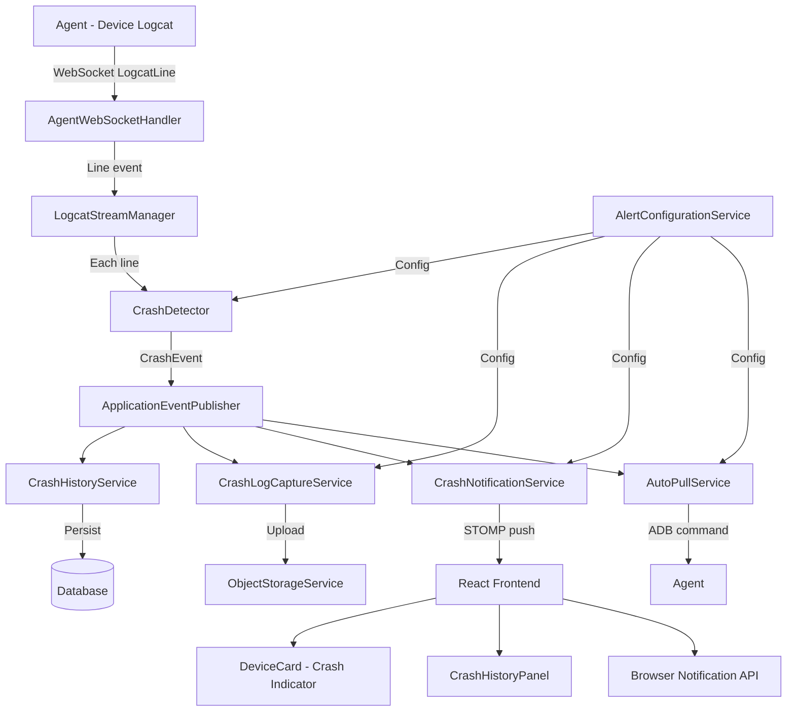

# Design Document: Crash Detection Alerts

## Overview

This design adds real-time crash detection and alerting to the Android Toolkit by introducing a `CrashDetector` service that hooks into the existing `LogcatStreamManager` pipeline. When logcat lines flow through the system (already streamed via STOMP WebSocket from agents), the `CrashDetector` applies regex-based pattern matching to identify crash signatures. Detected crashes produce `CrashEvent` objects that drive UI highlighting, browser notifications, automatic log capture to Object Storage, and historical persistence.

The architecture follows the existing Spring Boot service layer patterns, leveraging JPA for persistence, the existing `ObjectStorageService` for file storage, and STOMP WebSocket for real-time UI updates. The frontend extends the existing React + STOMP client to display crash indicators on `DeviceCard` components and provide crash history views.

### Key Design Decisions

1. **Backend-side detection**: Crash detection runs in the backend `LogcatStreamManager` rather than the agent, because the backend already receives all logcat lines via WebSocket and has access to project/tenant context needed for persistence and notification routing.
2. **Event-driven architecture**: The `CrashDetector` emits `CrashEvent` objects consumed by multiple downstream services (persistence, notification, log capture) via Spring's `ApplicationEventPublisher`, keeping components decoupled.
3. **Configurable patterns**: Both default and custom patterns are stored per-project in the database, allowing runtime updates without stream restarts.
4. **Rolling buffer per session**: The existing `LogcatSession` is extended with a configurable rolling buffer to capture pre-crash context.

## Architecture



### Component Interaction Flow

1. Agent streams logcat lines to backend via WebSocket (`LogcatLine` message type)
2. `AgentWebSocketHandler` forwards lines to `LogcatStreamManager`
3. `LogcatStreamManager` passes each line to `CrashDetector` and adds it to the session's rolling `LineBuffer`
4. `CrashDetector` matches the line against active patterns (default + custom for the project)
5. On match, `CrashDetector` applies deduplication (5-second window), extracts metadata, and publishes a `CrashEvent`
6. Event listeners handle persistence, log capture, notifications, and auto-pull independently

## Components and Interfaces

### Backend Components

#### CrashDetector

The core detection engine. Stateless pattern matching with per-device deduplication state.

```java
@Service
public class CrashDetector {
    
    // Matches a logcat line against all active patterns for the device's project
    public Optional<CrashEvent> analyze(String serial, String line, List<String> context);
    
    // Deduplication: returns true if this crash should be suppressed
    boolean isDuplicate(String serial, CrashEvent event);
    
    // Extract package name from logcat line context
    String extractPackageName(String line, List<String> context);
    
    // Classify severity based on matched pattern
    SeverityLevel classifySeverity(String matchedPattern);
}
```

#### CrashEvent (Domain Object / DTO)

```java
public record CrashEvent(
    String id,                    // UUID
    Instant timestamp,
    String deviceSerial,
    String deviceName,
    String packageName,
    String crashType,             // The matched pattern identifier
    SeverityLevel severity,
    String stackTraceSnippet,     // Up to 20 lines
    String crashLogPath,          // Object Storage path (set after upload)
    Long projectId,
    Long tenantId
) {}
```

#### SeverityLevel (Enum)

```java
public enum SeverityLevel {
    FATAL,   // FATAL EXCEPTION, SIGABRT, SIGSEGV
    ANR,     // ANR in
    WARNING  // All other patterns
}
```

#### CrashHistoryService

Handles persistence and querying of crash events.

```java
@Service
public class CrashHistoryService {
    
    CrashEventEntity persist(CrashEvent event);
    
    Page<CrashEventEntity> findByProject(Long projectId, CrashEventFilter filter, Pageable pageable);
    
    Optional<CrashEventEntity> findById(Long id);
    
    List<DailyCrashCount> getFrequencyByDay(Long projectId, LocalDate from, LocalDate to, GroupBy groupBy);
}
```

#### CrashLogCaptureService

Manages the rolling buffer and crash log upload.

```java
@Service
public class CrashLogCaptureService {
    
    // Captures buffer + post-crash lines, formats with header, uploads
    void captureCrashLog(CrashEvent event, Deque<String> lineBuffer, List<String> postCrashLines);
    
    // Formats the crash log file content with metadata header
    String formatCrashLog(CrashEvent event, List<String> bufferLines, List<String> postCrashLines);
    
    // Constructs the storage path
    String buildStoragePath(Long tenantId, Long projectId, String deviceSerial, Instant timestamp);
}
```

#### AlertConfigurationService

Manages per-project crash detection settings.

```java
@Service
public class AlertConfigurationService {
    
    AlertConfiguration getForProject(Long projectId);
    
    AlertConfiguration update(Long projectId, AlertConfigurationRequest request);
    
    // Custom pattern management
    void addCustomPattern(Long projectId, String regex, SeverityLevel severity);
    void removeCustomPattern(Long projectId, Long patternId);
    List<CrashPattern> getActivePatterns(Long projectId);
    
    // Validation
    ValidationResult validateRegex(String regex);
    ValidationResult validateBufferSize(int size);
}
```

#### CrashNotificationService

Pushes crash alerts to the frontend via STOMP.

```java
@Service
public class CrashNotificationService {
    
    void notifyCrash(CrashEvent event);
    
    // Builds the notification payload
    CrashNotificationPayload buildPayload(CrashEvent event);
}
```

#### AutoPullService

Triggers automatic log pulls when configured.

```java
@Service
public class AutoPullService {
    
    void triggerLogPull(CrashEvent event);
    
    boolean isPullInProgress(String deviceSerial);
}
```

### Frontend Components

#### CrashIndicator (React Component)

Renders on `DeviceCard` when crashes are detected.

```jsx
// Props: { crashes: CrashEvent[], onAcknowledge: (id) => void }
function CrashIndicator({ crashes, onAcknowledge }) { ... }
```

#### CrashHistoryPanel (React Component)

Displays paginated crash history with filters.

```jsx
// Props: { projectId: number }
function CrashHistoryPanel({ projectId }) { ... }
```

#### CrashDetailView (React Component)

Shows full crash event details with log download.

```jsx
// Props: { crashEventId: number }
function CrashDetailView({ crashEventId }) { ... }
```

#### AlertConfigPanel (React Component)

Configuration UI for crash detection settings.

```jsx
// Props: { projectId: number }
function AlertConfigPanel({ projectId }) { ... }
```

### REST API Endpoints

| Method | Path | Description |
|--------|------|-------------|
| GET | `/api/projects/{id}/crashes` | Paginated crash history with filters |
| GET | `/api/projects/{id}/crashes/{crashId}` | Single crash event detail |
| GET | `/api/projects/{id}/crashes/{crashId}/log` | Download crash log file |
| GET | `/api/projects/{id}/crash-trends` | Crash frequency trend data |
| GET | `/api/projects/{id}/alert-config` | Get alert configuration |
| PUT | `/api/projects/{id}/alert-config` | Update alert configuration |
| POST | `/api/projects/{id}/alert-config/patterns` | Add custom crash pattern |
| DELETE | `/api/projects/{id}/alert-config/patterns/{patternId}` | Remove custom pattern |
| PUT | `/api/projects/{id}/alert-config/patterns/{patternId}` | Update custom pattern |
| POST | `/api/projects/{id}/crashes/{crashId}/acknowledge` | Acknowledge a crash |

### WebSocket Topics

| Topic | Payload | Description |
|-------|---------|-------------|
| `/topic/crash/{deviceSerial}` | `CrashNotificationPayload` | Real-time crash alert for a device |
| `/topic/crash-count/{projectId}` | `{ count: number }` | Updated unacknowledged crash count |

## Data Models

### CrashEventEntity (JPA Entity)

```java
@Entity
@Table(name = "crash_events", indexes = {
    @Index(name = "idx_crash_project_timestamp", columnList = "project_id, timestamp DESC"),
    @Index(name = "idx_crash_device_timestamp", columnList = "device_serial, timestamp DESC"),
    @Index(name = "idx_crash_tenant", columnList = "tenant_id")
})
@Filter(name = "tenantFilter", condition = "tenant_id = :tenantId")
public class CrashEventEntity {
    @Id @GeneratedValue(strategy = GenerationType.IDENTITY)
    private Long id;
    
    @ManyToOne(fetch = FetchType.LAZY)
    @JoinColumn(name = "tenant_id")
    private Tenant tenant;
    
    @ManyToOne(fetch = FetchType.LAZY)
    @JoinColumn(name = "project_id")
    private Project project;
    
    @Column(nullable = false)
    private Instant timestamp;
    
    @Column(nullable = false)
    private String deviceSerial;
    
    @Column
    private String deviceName;
    
    @Column
    private String packageName;
    
    @Column(nullable = false)
    private String crashType;
    
    @Column(nullable = false)
    @Enumerated(EnumType.STRING)
    private SeverityLevel severity;
    
    @Column(columnDefinition = "TEXT")
    private String stackTraceSnippet;
    
    @Column
    private String crashLogPath;
    
    @Column
    private String autoPullLogPath;
    
    @Column(nullable = false)
    private boolean acknowledged = false;
    
    @Column
    private Instant acknowledgedAt;
}
```

### AlertConfigurationEntity (JPA Entity)

```java
@Entity
@Table(name = "alert_configurations")
@Filter(name = "tenantFilter", condition = "tenant_id = :tenantId")
public class AlertConfigurationEntity {
    @Id @GeneratedValue(strategy = GenerationType.IDENTITY)
    private Long id;
    
    @OneToOne(fetch = FetchType.LAZY)
    @JoinColumn(name = "project_id", unique = true)
    private Project project;
    
    @ManyToOne(fetch = FetchType.LAZY)
    @JoinColumn(name = "tenant_id")
    private Tenant tenant;
    
    @Column(nullable = false)
    private boolean crashDetectionEnabled = true;
    
    @Column(nullable = false)
    private boolean autoPullEnabled = false;
    
    @Column(nullable = false)
    @Enumerated(EnumType.STRING)
    private NotificationPreference notificationPreference = NotificationPreference.BROWSER;
    
    @Column(nullable = false)
    private int bufferSize = 500;
}
```

### CrashPatternEntity (JPA Entity)

```java
@Entity
@Table(name = "crash_patterns")
public class CrashPatternEntity {
    @Id @GeneratedValue(strategy = GenerationType.IDENTITY)
    private Long id;
    
    @ManyToOne(fetch = FetchType.LAZY)
    @JoinColumn(name = "project_id")
    private Project project;
    
    @Column(nullable = false)
    private String regex;
    
    @Column(nullable = false)
    @Enumerated(EnumType.STRING)
    private SeverityLevel severity;
    
    @Column(nullable = false)
    private boolean isDefault = false;
    
    @Column(nullable = false)
    private boolean enabled = true;
    
    @Column(nullable = false)
    private Instant createdAt = Instant.now();
}
```

### NotificationPreference (Enum)

```java
public enum NotificationPreference {
    BROWSER,
    IN_APP,
    BOTH,
    NONE
}
```

### CrashEventFilter (Query DTO)

```java
public record CrashEventFilter(
    String deviceSerial,
    LocalDate fromDate,
    LocalDate toDate,
    SeverityLevel severity,
    String crashType,
    Boolean acknowledged
) {}
```

### DailyCrashCount (Aggregation DTO)

```java
public record DailyCrashCount(
    LocalDate date,
    String groupKey,    // severity level or device serial depending on groupBy
    long count
) {}
```

### LineBuffer (Rolling Buffer)

Extension to the existing `LogcatSession`:

```java
public class LineBuffer {
    private final int capacity;
    private final Deque<String> lines;
    
    public LineBuffer(int capacity) {
        this.capacity = capacity;
        this.lines = new ArrayDeque<>(capacity);
    }
    
    public void add(String line) {
        if (lines.size() >= capacity) {
            lines.pollFirst();
        }
        lines.addLast(line);
    }
    
    public List<String> snapshot() {
        return List.copyOf(lines);
    }
    
    public int size() { return lines.size(); }
    public int getCapacity() { return capacity; }
}
```

## Correctness Properties

*A property is a characteristic or behavior that should hold true across all valid executions of a system — essentially, a formal statement about what the system should do. Properties serve as the bridge between human-readable specifications and machine-verifiable correctness guarantees.*

### Property 1: Crash detection with correct severity classification

*For any* logcat line that contains a registered crash pattern, the `CrashDetector` SHALL emit a `CrashEvent` with the severity correctly classified as FATAL for `FATAL EXCEPTION`/`SIGABRT`/`SIGSEGV`, ANR for `ANR in`, and WARNING for all other patterns.

**Validates: Requirements 1.1, 1.3**

### Property 2: Package name extraction

*For any* logcat crash line that contains a package name in the standard Android format (e.g., `com.example.app`), the `CrashDetector` SHALL extract and include that package name in the emitted `CrashEvent`.

**Validates: Requirements 1.4**

### Property 3: Stack trace snippet bounded to 20 lines

*For any* crash detection followed by N subsequent logcat lines, the extracted stack trace snippet SHALL contain at most 20 lines, and exactly min(N, 20) lines when N lines are available.

**Validates: Requirements 1.5**

### Property 4: Crash event deduplication within time window

*For any* sequence of crash pattern matches on the same device within a 5-second window, the `CrashDetector` SHALL emit exactly one `CrashEvent`, grouping all matches into that single event.

**Validates: Requirements 1.6**

### Property 5: CrashEvent serialization round-trip

*For any* valid `CrashEvent`, serializing to JSON and deserializing back SHALL produce an equivalent `CrashEvent` with all fields preserved.

**Validates: Requirements 1.7**

### Property 6: Rolling buffer invariant

*For any* sequence of N logcat lines added to a `LineBuffer` with capacity C, the buffer SHALL contain exactly min(N, C) lines, and those lines SHALL be the most recent min(N, C) lines in insertion order.

**Validates: Requirements 2.1**

### Property 7: Crash log capture completeness

*For any* `CrashEvent` with a non-empty line buffer and post-crash lines, the formatted crash log SHALL contain a metadata header (timestamp, device serial, package name, crash type, severity) followed by the buffer contents and up to 50 post-crash lines.

**Validates: Requirements 2.2, 2.6**

### Property 8: Crash log storage path format

*For any* combination of tenantId, projectId, deviceSerial, and timestamp, the constructed storage path SHALL match the format `crash-logs/{tenantId}/{projectId}/{deviceSerial}/{timestamp}.log`.

**Validates: Requirements 2.3**

### Property 9: Notification payload correctness

*For any* `CrashEvent` where the project's `AlertConfiguration` has notifications enabled, the notification payload SHALL contain the device name, crash type, and package name, and SHALL only be sent when the configuration permits it.

**Validates: Requirements 4.1, 4.4**

### Property 10: Concurrent auto-pull prevention

*For any* device with an in-progress log pull, subsequent crash events on that device SHALL NOT trigger additional log pulls until the current pull completes.

**Validates: Requirements 5.3**

### Property 11: CrashEvent database persistence round-trip

*For any* valid `CrashEvent`, persisting to the database and reading back SHALL produce an equivalent entity with all metadata fields preserved (timestamp, device serial, device name, package name, crash type, severity, stack trace snippet, crash log path, and project/tenant association).

**Validates: Requirements 6.1, 6.2, 6.4**

### Property 12: Multi-tenant data isolation

*For any* two distinct tenants A and B, querying crash events as tenant A SHALL never return crash events belonging to tenant B, regardless of filter criteria.

**Validates: Requirements 6.3**

### Property 13: Crash history filter correctness

*For any* set of crash events and any valid filter criteria (device serial, date range, severity, crash type), the returned results SHALL contain only events matching ALL specified filter criteria, ordered by timestamp descending, with correct pagination boundaries.

**Validates: Requirements 7.1, 7.3, 7.4**

### Property 14: Daily frequency aggregation completeness

*For any* date range [from, to] and set of crash events, the aggregation SHALL return exactly one data point per day in the range (inclusive), with the count equal to the number of crash events on that day matching the grouping criteria, including zero for days with no crashes.

**Validates: Requirements 7.5, 10.1, 10.2, 10.3**

### Property 15: Buffer size validation

*For any* integer value, the buffer size validation SHALL accept values in the range [50, 2000] inclusive and reject all values outside this range.

**Validates: Requirements 8.4**

### Property 16: Regex pattern validation

*For any* string, the regex validation SHALL accept strings that compile as valid Java regex patterns and reject strings that do not, returning a descriptive error for invalid patterns.

**Validates: Requirements 9.2**

### Property 17: Custom crash pattern round-trip

*For any* valid regex string and severity level, adding a custom crash pattern and then retrieving the pattern list SHALL include the added pattern with its original regex string and severity level preserved.

**Validates: Requirements 9.6**

## Error Handling

### Crash Detection Errors

| Error Scenario | Handling Strategy |
|---|---|
| Regex pattern fails to compile (custom pattern) | Reject with descriptive error message; do not save pattern |
| Logcat line is null or empty | Skip silently; no event emitted |
| Package name extraction fails | Set packageName to `"unknown"` in CrashEvent |
| Stack trace collection interrupted (stream ends) | Use whatever lines were collected (partial snippet) |

### Storage Errors

| Error Scenario | Handling Strategy |
|---|---|
| Object Storage upload fails | Retry up to 3 times with exponential backoff (1s, 2s, 4s) |
| All upload retries exhausted | Log error, store crash log locally at `data/crash-logs-fallback/`, record local path in CrashEvent |
| Local fallback storage full | Log critical error, proceed without crash log; CrashEvent still persisted |

### Auto-Pull Errors

| Error Scenario | Handling Strategy |
|---|---|
| Device disconnected during pull | Record failure in CrashEvent metadata; release pull lock |
| Pull timeout (60 seconds) | Abort pull, record timeout in metadata; release pull lock |
| Agent unreachable | Record failure; do not block other crash processing |

### Notification Errors

| Error Scenario | Handling Strategy |
|---|---|
| WebSocket send fails | Log warning; notification is best-effort |
| Browser notification permission denied | Fall back to in-app toast via STOMP |

### Database Errors

| Error Scenario | Handling Strategy |
|---|---|
| Persistence failure | Log error; crash detection continues (event lost) |
| Query timeout on history/trends | Return partial results with warning; suggest narrower date range |

## Testing Strategy

### Property-Based Testing (jqwik)

The project already uses **jqwik 1.9.1** for property-based testing. Each correctness property above maps to a property-based test with a minimum of 100 iterations.

**Test configuration:**
- Library: `net.jqwik:jqwik:1.9.1` (already in `build.gradle`)
- Minimum iterations: 100 per property
- Tag format: `@Tag("Feature: crash-detection-alerts, Property N: <title>")`

**Property tests to implement:**

| Property | Test Class | Key Generators |
|----------|-----------|----------------|
| 1: Severity classification | `CrashDetectorPropertyTest` | Random logcat lines with embedded crash patterns |
| 2: Package name extraction | `CrashDetectorPropertyTest` | Random logcat lines with Android package names |
| 3: Stack trace bounded | `CrashDetectorPropertyTest` | Random line sequences of varying length |
| 4: Deduplication | `CrashDetectorPropertyTest` | Random crash event sequences with timestamps |
| 5: Serialization round-trip | `CrashEventSerializationPropertyTest` | Random valid CrashEvent instances |
| 6: Buffer invariant | `LineBufferPropertyTest` | Random line sequences and buffer capacities |
| 7: Log capture completeness | `CrashLogCapturePropertyTest` | Random buffer states and post-crash lines |
| 8: Storage path format | `CrashLogCapturePropertyTest` | Random tenant/project/device/timestamp values |
| 9: Notification payload | `CrashNotificationPropertyTest` | Random CrashEvents and AlertConfigurations |
| 10: Concurrent pull prevention | `AutoPullServicePropertyTest` | Random crash event sequences per device |
| 11: DB round-trip | `CrashHistoryServicePropertyTest` | Random CrashEvent instances |
| 12: Multi-tenant isolation | `CrashHistoryServicePropertyTest` | Random events across multiple tenants |
| 13: Filter correctness | `CrashHistoryServicePropertyTest` | Random events and filter criteria |
| 14: Aggregation completeness | `CrashTrendPropertyTest` | Random events and date ranges |
| 15: Buffer size validation | `AlertConfigurationPropertyTest` | Random integers |
| 16: Regex validation | `AlertConfigurationPropertyTest` | Random strings (valid and invalid regex) |
| 17: Custom pattern round-trip | `AlertConfigurationPropertyTest` | Random valid regex strings and severity levels |

### Unit Tests (JUnit 5)

Unit tests cover specific examples, edge cases, and integration points:

- Default pattern recognition (each of the 6 default patterns)
- Default configuration values when no explicit config exists
- Crash log header format with known values
- Browser notification fallback when permissions denied
- Auto-pull failure recording
- Upload retry exhaustion and local fallback
- Invalid regex error messages (specific malformed patterns)
- Pagination boundary conditions (empty results, single page, multi-page)
- Preset date range calculations (7, 14, 30 days)

### Integration Tests (Testcontainers)

Integration tests verify end-to-end flows with real infrastructure:

- Crash event persistence and retrieval with PostgreSQL
- Crash log upload to MinIO
- WebSocket crash notification delivery
- Alert configuration hot-reload (update config, verify active sessions pick up changes)
- Multi-tenant isolation with real database queries
- Crash history pagination with real data volumes

### Frontend Tests

- React Testing Library tests for `CrashIndicator`, `CrashHistoryPanel`, `CrashDetailView`
- STOMP message handling for crash events
- Browser Notification API mocking
- Crash count badge rendering with multiple unacknowledged events
