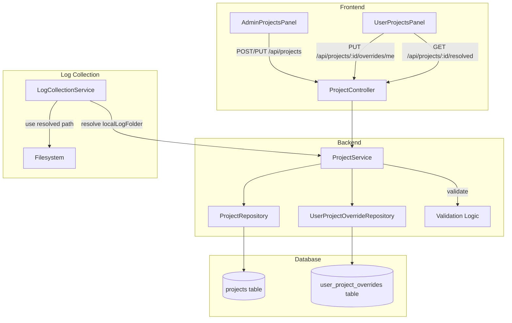
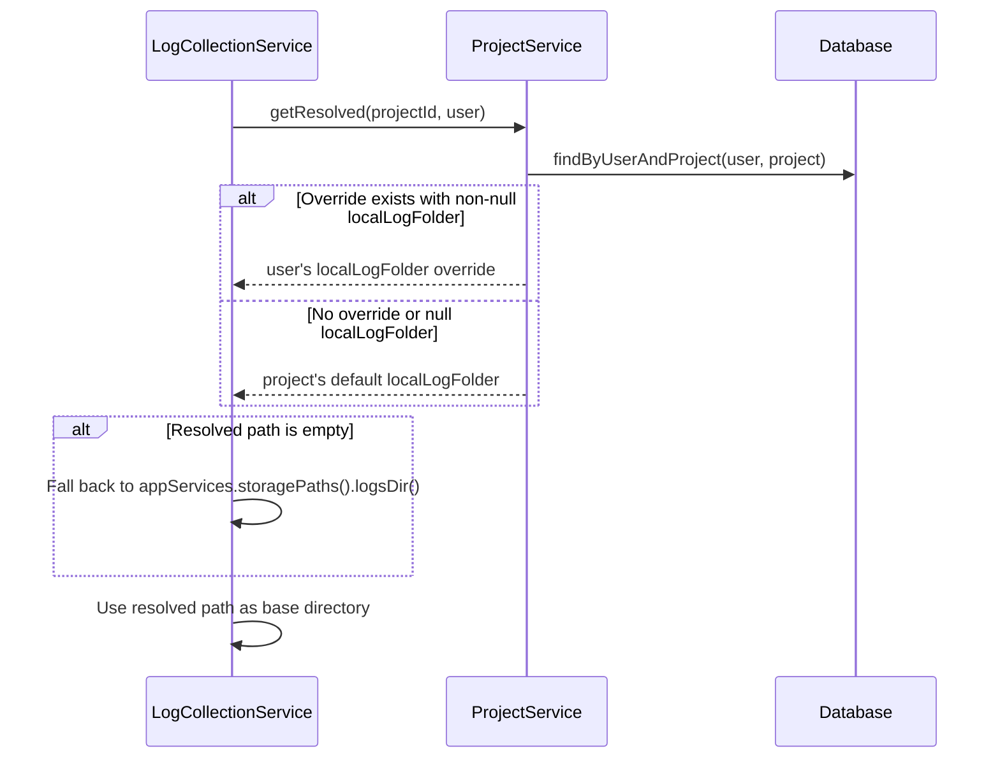

# Design Document: Default Log Location Setting

## Overview

This feature adds a `localLogFolder` setting to the project management system, mirroring the existing `localApkFolder` pattern. It enables admins to configure a default local log storage path per project, allows users to override it for their machine, and integrates the resolved path into the log collection workflow.

The design follows the established patterns in the codebase:
- **Entity layer**: Add `localLogFolder` to `Project` and `UserProjectOverride` entities
- **Service layer**: Extend `ProjectService` validation and resolution logic; update `LogCollectionService` to use the resolved path
- **DTO layer**: Extend `ProjectRequest`, `ProjectResponse`, `OverrideRequest`, `OverrideResponse`, and `ResolvedProjectResponse` records
- **Controller layer**: No new endpoints needed — existing endpoints already handle the DTOs
- **Frontend layer**: Extend `AdminProjectsPanel` and `UserProjectsPanel` components

## Architecture



### Resolution Flow



## Components and Interfaces

### Entity Changes

**Project Entity** — Add `localLogFolder` column:
```java
@Column(nullable = false, length = 1024)
private String localLogFolder;
```

**UserProjectOverride Entity** — Add `localLogFolder` column:
```java
@Column(length = 500)
private String localLogFolder;
```

The override field is nullable (unlike the project-level field) because a user may only override the APK folder without overriding the log folder, or vice versa.

### DTO Changes

**ProjectRequest** — Add `localLogFolder` field:
```java
public record ProjectRequest(String name, String remoteApkLocation, String localApkFolder, String localLogFolder) {}
```

**ProjectResponse** — Add `localLogFolder` field:
```java
public record ProjectResponse(Long id, String name, String remoteApkLocation, String localApkFolder, String localLogFolder, Instant createdAt) {}
```

**OverrideRequest** — Add `localLogFolder` field:
```java
public record OverrideRequest(String localApkFolder, String localLogFolder) {}
```

**OverrideResponse** — Add `localLogFolder` field:
```java
public record OverrideResponse(Long id, Long projectId, String localApkFolder, String localLogFolder) {}
```

**ResolvedProjectResponse** — Add `localLogFolder` and `overriddenLogFolder` fields:
```java
public record ResolvedProjectResponse(
    Long id, String name, String remoteApkLocation,
    String localApkFolder, boolean overridden,
    String localLogFolder, boolean overriddenLogFolder
) {}
```

### Service Changes

**ProjectService** — Extend validation and resolution:
- `validateRequest()`: Add validation for `localLogFolder` (required, non-blank, max 1024 chars after trim)
- `create()` / `update()`: Persist trimmed `localLogFolder`
- `setOverride()`: Validate and persist `localLogFolder` override (non-blank, max 500 chars)
- `getResolved()`: Resolve `localLogFolder` using override-first-then-default logic
- `toResponse()` / `toOverrideResponse()`: Include `localLogFolder` in mappings

**LogCollectionService** — Use resolved log folder:
- `collectLogs()`: Resolve `localLogFolder` for the authenticated user/project combination
- Use the resolved path as `baseLogsDir` instead of `appServices.storagePaths().logsDir()`
- Fall back to `appServices.storagePaths().logsDir()` when resolved path is empty or project is not associated

### Frontend Changes

**AdminProjectsPanel**:
- Add `localLogFolder` state for create form
- Add `editLocalLogFolder` state for edit form
- Add "Local Log Folder" input field in create form (placeholder: "Local Log Folder")
- Add "Local Log Folder" column in projects table
- Include `localLogFolder` in create/update API calls
- Prevent submission if `localLogFolder` is empty/blank

**UserProjectsPanel**:
- Display effective `localLogFolder` from resolved response
- Add input field for log folder override
- Add Save/Reset buttons for log folder override
- Visual indicator when override is active (e.g., different styling or label)
- Prevent save if override input is empty/blank

**projectApi**:
- No changes needed — existing endpoints already handle the extended DTOs

## Data Models

### Database Schema Changes

**projects table** — Add column:
```sql
ALTER TABLE projects ADD COLUMN local_log_folder VARCHAR(1024) NOT NULL DEFAULT '';
```

**user_project_overrides table** — Add column:
```sql
ALTER TABLE user_project_overrides ADD COLUMN local_log_folder VARCHAR(500) NULL;
```

### Validation Rules

| Field | Context | Max Length | Required | Trimmed |
|-------|---------|-----------|----------|---------|
| `localLogFolder` | Project create/update | 1024 | Yes | Yes |
| `localLogFolder` | User override set | 500 | Yes (when setting) | Yes |

### Resolution Priority

1. User's `UserProjectOverride.localLogFolder` (if non-null)
2. Project's `Project.localLogFolder` (default)
3. `appServices.storagePaths().logsDir()` (fallback when resolved is empty)

## Correctness Properties

*A property is a characteristic or behavior that should hold true across all valid executions of a system — essentially, a formal statement about what the system should do. Properties serve as the bridge between human-readable specifications and machine-verifiable correctness guarantees.*

### Property 1: Persistence Round-Trip

*For any* valid `localLogFolder` string (non-blank, ≤1024 characters), creating or updating a project with that value and then retrieving the project should return the trimmed version of the original input as the `localLogFolder`.

**Validates: Requirements 1.2, 1.3, 2.3**

### Property 2: Blank Input Rejection

*For any* string composed entirely of whitespace characters (including empty string and null), attempting to create a project, update a project, or set a user override with that value as `localLogFolder` should be rejected with a 400 Bad Request error, and the existing data should remain unchanged.

**Validates: Requirements 2.1, 2.2, 3.4**

### Property 3: Length Validation

*For any* string whose trimmed length exceeds the maximum allowed (1024 for project-level, 500 for user override), the operation should be rejected with a 400 Bad Request error, and the existing data should remain unchanged.

**Validates: Requirements 2.4, 3.5**

### Property 4: Resolution Logic

*For any* project with a default `localLogFolder` and any user, the resolved `localLogFolder` should equal the user's override value when a `UserProjectOverride` record exists with a non-null `localLogFolder`, and should equal the project's default `localLogFolder` otherwise.

**Validates: Requirements 4.1, 4.2, 3.3**

### Property 5: Log Collection Uses Resolved Path

*For any* device associated with a project and any authenticated user, the log collection base directory should equal the resolved `localLogFolder` for that user/project combination (override if present, project default otherwise), falling back to the application default logs directory only when the resolved value is empty or no project is associated.

**Validates: Requirements 8.1, 8.2, 8.3**

### Property 6: Subdirectory Structure Preservation

*For any* resolved base directory used during log collection, the log files should be stored under the path `{baseDir}/{flavor}/{deviceName}_{serial}/{date}/`, preserving the existing subdirectory structure regardless of what the base directory value is.

**Validates: Requirements 8.5**

## Error Handling

| Scenario | HTTP Status | Error Message |
|----------|-------------|---------------|
| `localLogFolder` is null/empty/blank on project create/update | 400 | "Local log folder is required" |
| `localLogFolder` exceeds 1024 chars on project create/update | 400 | "Local log folder exceeds the maximum allowed length" |
| `localLogFolder` is null/empty/blank on override set | 400 | "Local log folder is required" |
| `localLogFolder` exceeds 500 chars on override set | 400 | "Local log folder exceeds the maximum allowed length" |
| Project not found for resolved/override requests | 404 | "Project not found" |
| Resolved directory doesn't exist on filesystem | N/A | Create directory silently (log warning on failure) |
| Directory creation fails | N/A | Log warning, continue with best-effort (existing behavior) |

### Frontend Validation

The frontend performs client-side validation before sending API requests:
- Empty/blank `localLogFolder` prevents form submission (no API call made)
- This provides immediate feedback without a server round-trip
- Server-side validation remains the authoritative check

## Testing Strategy

### Property-Based Tests (jqwik)

The project already uses **jqwik** for property-based testing (see `LogcatParserProperties.java`). Each correctness property will be implemented as a jqwik `@Property` test with a minimum of 100 iterations.

**Test class**: `ProjectServiceLogFolderProperties.java`

| Property | Test Method | Generator Strategy |
|----------|-------------|-------------------|
| Property 1: Persistence Round-Trip | `persistenceRoundTrip_localLogFolder` | Generate random strings (1–1024 chars) with optional leading/trailing whitespace |
| Property 2: Blank Input Rejection | `blankInput_rejectedForLogFolder` | Generate strings of whitespace chars (spaces, tabs, newlines) of varying lengths |
| Property 3: Length Validation | `overlengthInput_rejectedForLogFolder` | Generate strings with trimmed length > 1024 (project) or > 500 (override) |
| Property 4: Resolution Logic | `resolution_prefersOverrideThenDefault` | Generate random project defaults and optional override values |
| Property 5: Log Collection Resolution | `logCollection_usesResolvedPath` | Generate random project/override combinations with mock dependencies |
| Property 6: Subdirectory Structure | `logCollection_preservesSubdirectoryStructure` | Generate random base directories, flavors, device names, serials |

**Configuration**: Each property test runs with `@Property(tries = 100)` minimum.

**Tag format**: Each test includes a comment referencing the design property:
```java
// Feature: default-log-location-setting, Property 1: Persistence Round-Trip
```

### Unit Tests (JUnit 5)

Unit tests cover specific examples, edge cases, and integration points:

- **ProjectService**: Create/update with valid `localLogFolder`, verify response includes field
- **ProjectService**: Override CRUD operations for `localLogFolder`
- **ProjectService**: Resolution with and without override
- **ProjectController**: API endpoint integration tests for new fields
- **LogCollectionService**: Fallback to default directory when no project associated
- **LogCollectionService**: Directory creation when path doesn't exist
- **Frontend**: Component rendering tests for new input fields and columns

### Integration Tests

- End-to-end API tests verifying the full create → override → resolve → collect flow
- Database migration verification (column exists with correct constraints)
