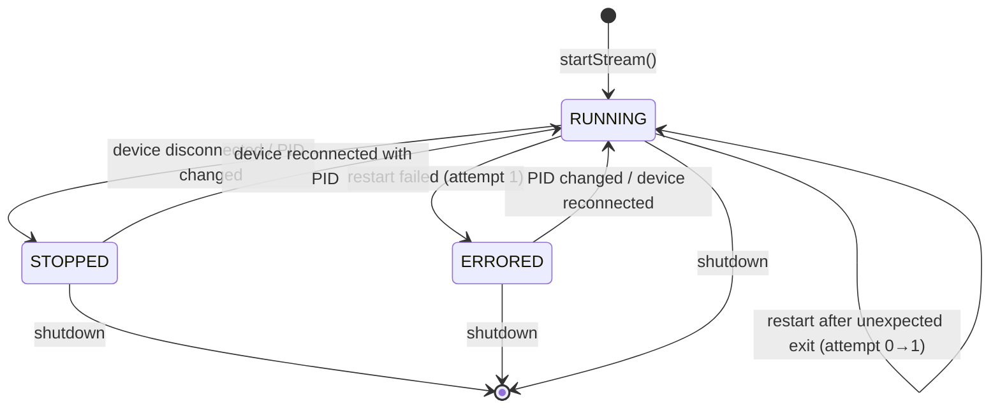

# Design Document: Real-Time Logcat Streaming

## Overview

This feature adds per-device real-time logcat streaming to the AndroidToolkit backend. A new `LogcatStreamManager` service observes device discovery events from the existing `DeviceMonitorService` and manages background `adb logcat` processes for each device running SafePath with a valid PID. A `LogcatParser` component extracts structured data (environment, client version, server product version, access token) from OkHttp log lines using regex pattern matching. Extracted data is pushed to the frontend via the existing STOMP/SockJS WebSocket infrastructure on per-device topics (`/topic/logcat/{serial}`).

The design prioritizes:
- **Decoupling** from the existing device monitor polling loop (logcat failures never block device discovery)
- **Minimal resource usage** via PID and tag filtering at the ADB level
- **Graceful degradation** with a single retry on failure, then error state until next PID change

## Architecture

```mermaid
graph TD
    DMS[DeviceMonitorService<br/>@Scheduled 3s poll] -->|discoverDevices| DC[DeviceCatalog]
    DC -->|DeviceDiscoveryResult| DMS
    DMS -->|broadcastDeviceUpdate| WS1[/topic/devices]
    
    DMS -->|notifyDeviceChanges| LSM[LogcatStreamManager]
    LSM -->|start/stop processes| ADB[adb logcat -s OkHttp:I --pid=X]
    ADB -->|stdout lines| LP[LogcatParser]
    LP -->|LogcatData| LSM
    LSM -->|broadcast| WS2[/topic/logcat/{serial}]
    
    LSM -->|tracks state| SM[StreamState Map<br/>serial → running/stopped/errored]
```

### Key Design Decisions

1. **Observer pattern over tight coupling**: `LogcatStreamManager` subscribes to device change notifications from `DeviceMonitorService` rather than running its own polling loop. This avoids duplicate ADB calls and keeps the two services independent.

2. **One `Process` per device**: Each monitored device gets exactly one `ProcessBuilder`-launched `adb logcat` process. The manager maintains a `ConcurrentHashMap<String, LogcatSession>` to track active sessions.

3. **Async line reading**: Each logcat process's stdout is consumed on a dedicated virtual thread (Project Loom, Java 21) to avoid blocking the scheduler thread pool.

4. **Stateless parser**: `LogcatParser` is a pure function component — it takes a log line and returns an `Optional<ParsedField>`. No internal state, making it trivially testable.

## Components and Interfaces

### LogcatStreamManager (Service)

```java
package androidtoolkit.backend.service;

@Service
public class LogcatStreamManager {

    // Lifecycle
    void onDevicesChanged(List<DeviceInfo> currentDevices);
    void shutdown(); // @PreDestroy

    // Internal
    void startStream(String serial, String pid);
    void stopStream(String serial);
    void restartStream(String serial, String pid);
    
    // State query
    StreamState getStreamState(String serial);
}
```

**Responsibilities:**
- Starts/stops logcat processes in response to device list changes
- Detects PID changes and restarts streams accordingly
- Implements retry logic (one restart after 5s delay on unexpected exit)
- Broadcasts `LogcatData` via `SimpMessagingTemplate`
- Cleans up all processes on application shutdown (`@PreDestroy`)

### LogcatParser (Component)

```java
package androidtoolkit.backend.service;

@Component
public class LogcatParser {

    Optional<ParsedField> parseLine(String line);
}
```

**Responsibilities:**
- Applies regex patterns to each logcat line
- Returns the first matching field extraction (environment, client version, server version, or access token)
- Stateless — all state lives in `LogcatStreamManager`

### LogcatData (DTO)

```java
package androidtoolkit.backend.dto;

public class LogcatData {
    private String serial;
    private String environment;       // nullable
    private String clientVersion;     // nullable
    private String serverProductVersion; // nullable
    private String accessToken;       // nullable
}
```

### ParsedField (Internal Value Object)

```java
package androidtoolkit.backend.service;

public record ParsedField(FieldType type, String value) {}

public enum FieldType {
    ENVIRONMENT, CLIENT_VERSION, SERVER_PRODUCT_VERSION, ACCESS_TOKEN
}
```

### LogcatSession (Internal State)

```java
package androidtoolkit.backend.service;

class LogcatSession {
    String serial;
    String pid;
    Process process;
    Thread readerThread;
    StreamState state;       // RUNNING, STOPPED, ERRORED
    int restartAttempts;     // 0 or 1
    LogcatData currentData;
}
```

### StreamState (Enum)

```java
public enum StreamState {
    RUNNING, STOPPED, ERRORED
}
```

### Integration with DeviceMonitorService

The `DeviceMonitorService` will be minimally modified to notify `LogcatStreamManager` after each poll cycle:

```java
// In DeviceMonitorService.checkForDeviceChanges():
logcatStreamManager.onDevicesChanged(result.getDevices().stream()
    .map(ConnectedDevice::getDeviceInfo)
    .toList());
```

This is a one-line addition — the `LogcatStreamManager` handles all diffing logic internally.

## Data Models

### LogcatData (WebSocket Payload)

| Field | Type | Description | Source Pattern |
|-------|------|-------------|----------------|
| serial | String | Device serial number | From DeviceInfo |
| environment | String? | API hostname | `--> {METHOD} https://{host}/...` |
| clientVersion | String? | App version | `User-Agent: SafePath {ver} Android` |
| serverProductVersion | String? | Server version | `x-safepath-product-version: {ver}` |
| accessToken | String? | JWT token | `"accessToken":"{token}"` or `Authorization: Bearer {token}` |

### Regex Patterns

| Field | Pattern | Capture Group |
|-------|---------|---------------|
| Environment | `-->\s+\w+\s+https?://([^/]+)/` | Group 1: hostname |
| Client Version | `User-Agent:\s+SafePath\s+(\S+)\s+Android` | Group 1: version string |
| Server Product Version | `x-safepath-product-version:\s+(\S+)` | Group 1: version string |
| Access Token (response) | `"accessToken"\s*:\s*"([^"]+)"` | Group 1: token |
| Access Token (request) | `Authorization:\s+Bearer\s+(\S+)` | Group 1: token |

### Stream State Machine



## Correctness Properties

*A property is a characteristic or behavior that should hold true across all valid executions of a system — essentially, a formal statement about what the system should do. Properties serve as the bridge between human-readable specifications and machine-verifiable correctness guarantees.*

### Property 1: Device lifecycle diffing

*For any* two consecutive device lists (previous and current), the LogcatStreamManager SHALL start streams for devices that are new or have changed PIDs, and stop streams for devices that are no longer present — resulting in exactly one active stream per device with a valid PID in the current list.

**Validates: Requirements 1.1, 1.2, 1.3**

### Property 2: Command format construction

*For any* valid device serial and PID string, the constructed logcat command SHALL equal `adb -s {serial} logcat -s OkHttp:I --pid={pid}` with the serial and PID substituted verbatim.

**Validates: Requirements 1.4, 5.1, 5.2**

### Property 3: Environment parsing

*For any* valid HTTP method and URL with a hostname, a logcat line formatted as `--> {METHOD} {URL}` SHALL cause the parser to extract exactly the hostname portion of the URL as the environment value.

**Validates: Requirements 2.1**

### Property 4: Client version parsing

*For any* non-empty version string (containing alphanumeric characters, dots, dashes, plus signs), a logcat line formatted as `User-Agent: SafePath {version} Android` SHALL cause the parser to extract exactly that version string as the client version value.

**Validates: Requirements 2.2**

### Property 5: Server product version parsing

*For any* non-empty version string, a logcat line formatted as `x-safepath-product-version: {version}` SHALL cause the parser to extract exactly that version string as the server product version value.

**Validates: Requirements 2.3**

### Property 6: Access token parsing

*For any* non-empty token string (not containing quotes or whitespace), a logcat line containing either `"accessToken":"{token}"` or `Authorization: Bearer {token}` SHALL cause the parser to extract exactly that token string as the access token value.

**Validates: Requirements 2.4, 2.5**

### Property 7: LogcatData state update — last write wins

*For any* sequence of ParsedField values applied to a LogcatData object, the final state of each field SHALL equal the last value of that field type in the sequence, and fields with no values in the sequence SHALL remain null.

**Validates: Requirements 2.6**

### Property 8: Broadcast completeness

*For any* LogcatData state (with any combination of null and non-null fields), the WebSocket broadcast payload SHALL always contain all four field keys (environment, clientVersion, serverProductVersion, accessToken) plus the serial.

**Validates: Requirements 3.2**

### Property 9: At most one process per device

*For any* sequence of device change events applied to the LogcatStreamManager, at no point SHALL there be more than one active logcat process for any single device serial.

**Validates: Requirements 5.4**

### Property 10: Shutdown terminates all

*For any* set of active logcat sessions, calling shutdown SHALL result in zero active processes and all sessions in STOPPED state.

**Validates: Requirements 5.3**

## Error Handling

| Scenario | Behavior | Recovery |
|----------|----------|----------|
| `adb logcat` process exits unexpectedly | Log warning, schedule restart after 5s | One retry attempt; if that fails, mark ERRORED |
| `adb logcat` process cannot start | Log warning, mark ERRORED | Wait for next PID change or device reconnection |
| Restart attempt fails | Log error, mark stream ERRORED | No further retries until PID change or reconnect |
| Regex parse fails (no match) | Line is silently skipped | No action needed — most lines won't match |
| WebSocket send fails | Log warning | Next successful parse will trigger another send |
| Device serial contains special characters | Use serial verbatim in command | ADB handles serial escaping |
| Application shutdown during active streams | `@PreDestroy` destroys all processes | Processes are forcibly terminated |
| `DeviceMonitorService` throws during poll | LogcatStreamManager is not notified | Streams continue with last known state |

### Error Isolation Principle

The `LogcatStreamManager` operates on its own threads (virtual threads for line reading, scheduled executor for retry delays). Exceptions in logcat processing never propagate to the `DeviceMonitorService` scheduled task. This ensures device discovery continues uninterrupted regardless of logcat failures.

## Testing Strategy

### Property-Based Tests (jqwik)

The project already includes `net.jqwik:jqwik:1.9.1` as a test dependency. Property-based tests will use jqwik to validate the correctness properties defined above.

**Configuration:**
- Minimum 100 iterations per property test (`@Property(tries = 100)`)
- Each test tagged with feature and property reference
- Tag format: `Feature: realtime-logcat-streaming, Property {N}: {title}`

**Target components for PBT:**
- `LogcatParser.parseLine()` — Properties 3, 4, 5, 6 (pure function, ideal for PBT)
- `LogcatData` state update logic — Property 7
- Command construction — Property 2
- Broadcast payload serialization — Property 8

### Unit Tests (JUnit 5)

Example-based tests for:
- Stream state transitions (RUNNING → STOPPED → RUNNING, RUNNING → ERRORED)
- Retry logic timing (5-second delay, single retry)
- Process isolation (one device failure doesn't affect others)
- Shutdown cleanup
- Integration with `SimpMessagingTemplate` (mock-based)

### Integration Tests

- End-to-end test with a mock ADB process that emits known log lines
- Verify WebSocket messages arrive on correct topics with correct payloads
- Verify lifecycle: device appears → stream starts → data extracted → device disappears → stream stops

### Test Organization

```
backend/test/androidtoolkit/backend/service/
├── LogcatParserTest.java          (unit + property tests for parsing)
├── LogcatParserProperties.java    (jqwik property tests)
├── LogcatStreamManagerTest.java   (unit tests for lifecycle)
├── LogcatStreamManagerProperties.java (jqwik property tests for diffing/invariants)
└── LogcatDataTest.java            (property tests for state updates)
```

