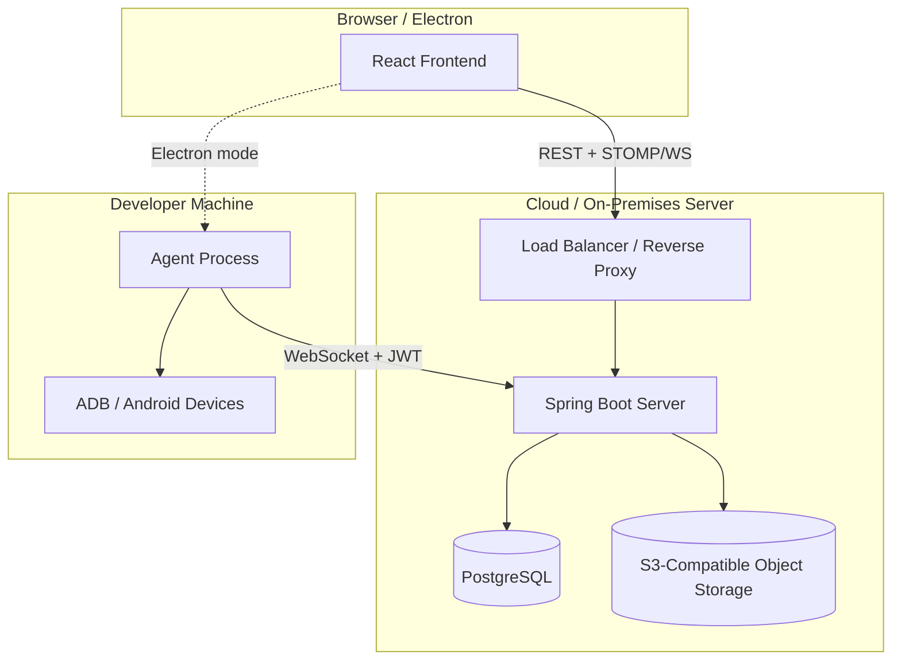
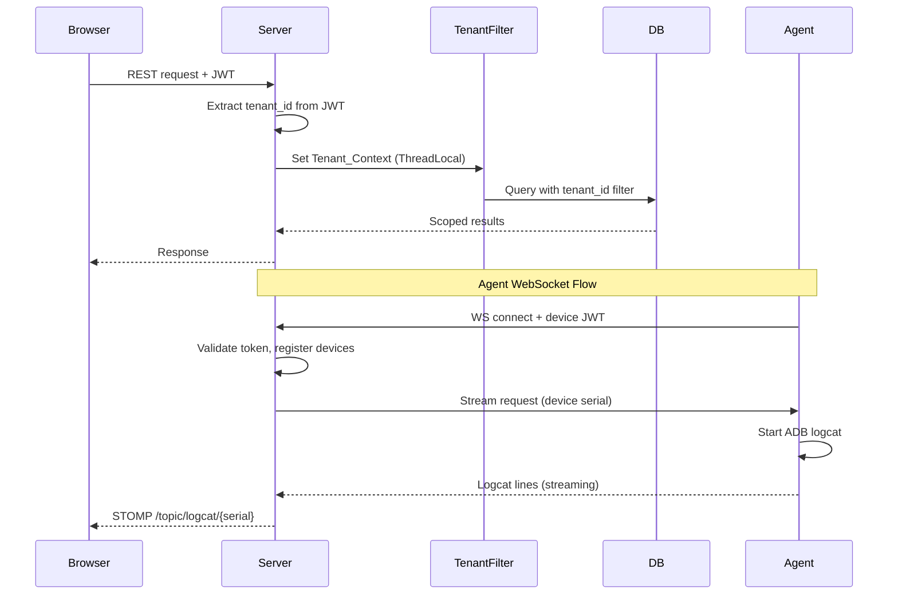

# Design Document: SaaS Multi-Tenant Architecture

## Overview

This design transforms the Android Toolkit from a standalone single-machine application into a cloud-agnostic, multi-tenant SaaS product. The current system runs Spring Boot 3.4 + React 19 + ADB operations on one machine with MySQL/H2. The new architecture splits responsibilities between:

- **Server** (cloud-hosted): Authentication, tenant management, data persistence, AI log analysis, report generation, Object Storage coordination
- **Agent** (local): ADB device operations (logcat streaming, log pulling, app install/uninstall, screenshots), bridging device data to the Server via WebSocket

The system supports three subscription tiers (FREE, PRO, ENTERPRISE) from a single codebase, with strict tenant data isolation enforced at the data access layer.

### Key Design Decisions

1. **Tenant isolation via row-level scoping** — Every entity gets a `tenant_id` column; a JPA `@Filter` + Spring interceptor ensures all queries are tenant-scoped automatically.
2. **Agent as a thin WebSocket client** — The Agent runs the existing `LogcatStreamManager` logic locally and streams parsed data to the Server. No business logic moves to the Agent beyond ADB operations.
3. **Feature gating via a `TierEnforcer` service** — A centralized service checks tier limits before operations, returning 429 when exceeded.
4. **Cloud-agnostic storage abstraction** — An `ObjectStorageService` interface with S3-compatible implementation (works with AWS S3, MinIO, GCP, Azure via S3 compatibility layer).
5. **Standalone fallback mode** — When `DEPLOYMENT_MODE=standalone`, the Server uses embedded H2 and local filesystem storage, preserving current single-user behavior.

## Architecture

### High-Level System Diagram



### Request Flow



### Module Structure

The project retains its Gradle multi-module layout with a new `agent` module:

```
AndroidToolkit/
├── backend/          # Spring Boot Server (cloud-hosted)
│   ├── src/
│   │   └── androidtoolkit/backend/
│   │       ├── config/         # Security, WebSocket, Tenant, Storage configs
│   │       ├── controller/     # REST + WS controllers
│   │       ├── dto/            # Request/Response DTOs
│   │       ├── entity/         # JPA entities (all with tenant_id)
│   │       ├── repository/     # Spring Data JPA repos
│   │       ├── security/       # JWT, TenantContext, filters
│   │       ├── service/        # Business logic, TierEnforcer
│   │       └── migration/      # Standalone-to-cloud migration
│   └── resources/
├── agent/            # Lightweight local Agent (NEW)
│   ├── src/
│   │   └── androidtoolkit/agent/
│   │       ├── AgentApplication.java
│   │       ├── connection/     # WebSocket client, reconnection
│   │       ├── adb/            # ADB command execution
│   │       └── stream/         # Logcat streaming (moved from backend)
│   └── resources/
├── core/             # Shared domain models, DTOs
└── frontend/         # React SPA
```

## Components and Interfaces

### 1. Tenant Context Resolution

```java
// Stored in ThreadLocal, set by JwtAuthFilter
public class TenantContext {
    private static final ThreadLocal<Long> currentTenantId = new ThreadLocal<>();
    
    public static void setTenantId(Long tenantId) { currentTenantId.set(tenantId); }
    public static Long getTenantId() { return currentTenantId.get(); }
    public static void clear() { currentTenantId.remove(); }
}

// Hibernate filter applied to all tenant-scoped entities
@FilterDef(name = "tenantFilter", parameters = @ParamDef(name = "tenantId", type = Long.class))
@Filter(name = "tenantFilter", condition = "tenant_id = :tenantId")
```

### 2. Tenant Entity & Subscription Management

```java
public interface TenantService {
    Tenant createTenant(String name, SubscriptionTier tier);
    Tenant getTenant(Long tenantId);
    void updateTier(Long tenantId, SubscriptionTier newTier);
    TierLimits getCurrentUsage(Long tenantId);
}
```

### 3. Tier Enforcement Service

```java
public interface TierEnforcer {
    /** Throws TierLimitExceededException (maps to 429) if limit reached */
    void checkDeviceLimit(Long tenantId);
    void checkUserLimit(Long tenantId);
    void checkAnalysisLimit(Long tenantId);
    void checkStorageLimit(Long tenantId, long additionalBytes);
}
```

### 4. Object Storage Service

```java
public interface ObjectStorageService {
    /** Upload a file to tenant-scoped path */
    String upload(Long tenantId, String projectPrefix, String filename, InputStream data, long size);
    
    /** Download a file */
    InputStream download(String objectKey);
    
    /** Delete (or archive) a file */
    void archive(String objectKey);
    
    /** Calculate total storage used by tenant */
    long getTenantStorageUsage(Long tenantId);
}
```

Implementation uses AWS SDK v2 S3 client configured via environment variables (`STORAGE_ENDPOINT`, `STORAGE_BUCKET`, `STORAGE_ACCESS_KEY`, `STORAGE_SECRET_KEY`).

### 5. Agent WebSocket Protocol

```java
// Server-side: handles Agent connections
public interface AgentConnectionManager {
    void registerAgent(String agentId, Long tenantId, Long userId, WebSocketSession session);
    void unregisterAgent(String agentId);
    void sendToAgent(String agentId, AgentCommand command);
    Optional<String> findAgentForDevice(Long tenantId, String deviceSerial);
}

// Commands sent Server → Agent
sealed interface AgentCommand {
    record StartLogcat(String serial, String requestId) implements AgentCommand {}
    record StopLogcat(String serial) implements AgentCommand {}
    record PullLogs(String serial, String targetPath) implements AgentCommand {}
    record InstallApk(String serial, String apkUrl) implements AgentCommand {}
    record UninstallApp(String serial, String packageName) implements AgentCommand {}
    record CaptureScreenshot(String serial) implements AgentCommand {}
}

// Messages sent Agent → Server
sealed interface AgentMessage {
    record LogcatLine(String serial, String line, long timestamp) implements AgentMessage {}
    record DeviceList(List<DeviceInfo> devices) implements AgentMessage {}
    record OperationResult(String requestId, boolean success, String detail) implements AgentMessage {}
    record LogArchiveReady(String serial, String localPath) implements AgentMessage {}
}
```

### 6. Audit Log Service

```java
public interface AuditLogService {
    void log(AuditAction action, Long actorUserId, Long tenantId, 
             String targetResource, AuditOutcome outcome, Map<String, String> metadata);
    
    Page<AuditLogEntry> query(Long tenantId, AuditLogFilter filter, Pageable pageable);
}
```

Only records entries when tenant tier is ENTERPRISE (checked internally).

### 7. Migration Service

```java
public interface MigrationService {
    MigrationResult importStandaloneArchive(InputStream archive, Long targetTenantId);
}

record MigrationResult(
    int projectsImported, int usersImported, int logsImported,
    List<MigrationConflict> conflicts
) {}
```

### 8. User & Role Management

```java
public interface UserManagementService {
    PendingInvite inviteUser(Long tenantId, String email, TenantRole role);
    User acceptInvitation(String inviteToken);
    void assignRole(Long tenantId, Long userId, TenantRole newRole);
    List<TenantMember> listMembers(Long tenantId);
}
```

## Data Models

### Entity Relationship Diagram

```mermaid
erDiagram
    Tenant ||--o{ User : "has members"
    Tenant ||--o{ Project : "owns"
    Tenant ||--o{ AuditLogEntry : "records"
    Tenant ||--o{ AgentRegistration : "registers"
    User ||--o{ TenantMembership : "belongs to"
    Tenant ||--o{ TenantMembership : "has"
    Project ||--o{ LogUploadMetadata : "contains"
    Project ||--o{ AnalysisReport : "has"
    User ||--o{ RefreshToken : "has"
    User ||--o{ PendingInvite : "invited by"

    Tenant {
        Long id PK
        String name
        SubscriptionTier tier
        Instant createdAt
        String storagePrefix
    }

    TenantMembership {
        Long id PK
        Long tenantId FK
        Long userId FK
        TenantRole role
        Instant joinedAt
    }

    User {
        Long id PK
        String username
        String email
        String passwordHash
        Instant createdAt
    }

    Project {
        Long id PK
        Long tenantId FK
        String name
        String storagePrefix
        Instant createdAt
        boolean archived
    }

    AgentRegistration {
        Long id PK
        Long tenantId FK
        Long userId FK
        String agentId
        Instant connectedAt
        String status
    }

    AuditLogEntry {
        Long id PK
        Long tenantId FK
        Long actorUserId FK
        Instant timestamp
        String actionType
        String targetResource
        String outcome
        String metadata
    }

    LogUploadMetadata {
        Long id PK
        Long tenantId FK
        Long projectId FK
        String objectKey
        Long sizeBytes
        Instant uploadedAt
    }

    AnalysisReport {
        Long id PK
        Long tenantId FK
        Long projectId FK
        String reportObjectKey
        Instant createdAt
        String status
    }
}
```

### Key Schema Changes from Current Model

| Current Entity | Change |
|---|---|
| `User` | Remove `tier` and `role` columns. Add `TenantMembership` join table for multi-tenant roles. |
| `Project` | Add `tenant_id` FK. Replace `localApkFolder` with `storagePrefix`. Add `archived` flag. |
| `LogUploadMetadata` | Add `tenant_id` FK. Replace local path with `objectKey` (S3 key). |
| `AnalysisReport` | Add `tenant_id` FK. Store report in Object Storage. |
| `AnalysisJobExecution` | Add `tenant_id` FK. Track monthly count for tier enforcement. |
| (NEW) `Tenant` | Central tenant entity with tier and storage config. |
| (NEW) `TenantMembership` | Maps users to tenants with roles (OWNER, ADMIN, USER). |
| (NEW) `AgentRegistration` | Tracks connected agents and their devices. |
| (NEW) `AuditLogEntry` | Append-only audit trail for ENTERPRISE tenants. |

### Subscription Tier Limits

| Resource | FREE | PRO | ENTERPRISE |
|---|---|---|---|
| Users per tenant | 1 | 20 | Unlimited |
| Devices per tenant | 2 | Unlimited | Unlimited |
| AI analyses per month | 5 | Unlimited | Unlimited |
| Object Storage | 500 MB | 50 GB | Unlimited |
| SSO Integration | No | No | Yes |
| Audit Logging | No | No | Yes |

### Configuration (Environment Variables)

| Variable | Description | Default |
|---|---|---|
| `DEPLOYMENT_MODE` | `saas` or `standalone` | `standalone` |
| `DATABASE_URL` | PostgreSQL JDBC URL | H2 embedded |
| `STORAGE_ENDPOINT` | S3-compatible endpoint | Local filesystem |
| `STORAGE_BUCKET` | Bucket name | `androidtoolkit` |
| `STORAGE_ACCESS_KEY` | S3 access key | — |
| `STORAGE_SECRET_KEY` | S3 secret key | — |
| `JWT_SECRET` | JWT signing key | Generated |
| `CORS_ALLOWED_ORIGINS` | Comma-separated origins | `*` |
| `SMTP_HOST` | Email server for invitations | — |
| `SSO_PROVIDER_URL` | OIDC/SAML provider URL (ENTERPRISE) | — |

## Correctness Properties

*A property is a characteristic or behavior that should hold true across all valid executions of a system — essentially, a formal statement about what the system should do. Properties serve as the bridge between human-readable specifications and machine-verifiable correctness guarantees.*

### Property 1: Tenant Data Isolation

*For any* tenant context and any database query, the results SHALL contain only entities whose `tenant_id` matches the resolved Tenant_Context — no entity belonging to a different tenant shall ever appear in query results.

**Validates: Requirements 1.3, 8.1, 8.3**

### Property 2: Cross-Tenant Access Rejection

*For any* resource belonging to tenant A and any authenticated request from tenant B (where A ≠ B), the Server SHALL return HTTP 403 and the resource data SHALL NOT be included in the response.

**Validates: Requirements 1.4**

### Property 3: Tenant-Scoped Storage Keys

*For any* file upload operation with a given tenant_id, the resulting Object Storage key SHALL contain the tenant's dedicated prefix, and no two different tenants SHALL share a storage prefix.

**Validates: Requirements 1.5, 8.2**

### Property 4: Tier Limit Enforcement

*For any* tenant with a given Subscription_Tier and current resource usage, the TierEnforcer SHALL reject operations that would exceed the tier's limits (FREE: 1 user, 2 devices, 5 analyses/month, 500MB storage; PRO: 20 users, unlimited devices, unlimited analyses, 50GB storage; ENTERPRISE: no limits) and SHALL allow operations that remain within limits.

**Validates: Requirements 3.2, 3.3, 3.4, 3.5, 3.6, 3.7, 3.8, 3.9, 3.10**

### Property 5: Role-Based Access Control

*For any* user with role USER attempting a privileged operation (project creation/deletion, user invitation, role assignment), the Server SHALL reject the operation; and *for any* user with role OWNER or ADMIN, the Server SHALL allow the operation.

**Validates: Requirements 4.5, 4.6, 8.4**

### Property 6: Invitation Tenant Scoping

*For any* invitation created by an ADMIN/OWNER user in tenant T, the invitation SHALL be associated with tenant T, and when accepted, the new user account SHALL be created within tenant T (not any other tenant).

**Validates: Requirements 4.1, 4.2**

### Property 7: Migration Data Preservation (Round-Trip)

*For any* valid standalone data export containing projects, users, and log metadata, importing the archive into a new tenant SHALL preserve all project names, usernames, and email addresses, and all log files SHALL be stored under the new tenant's Object Storage prefix.

**Validates: Requirements 6.2, 6.3, 6.4**

### Property 8: Migration Conflict Resilience

*For any* migration archive containing records that conflict with existing data, the migration SHALL complete without aborting, all non-conflicting records SHALL be imported, and all conflicts SHALL be reported in the result.

**Validates: Requirements 6.5**

### Property 9: Audit Log Completeness (Enterprise Only)

*For any* security-relevant action (authentication, role change, data export) performed within an ENTERPRISE tenant, an Audit_Log entry SHALL be created with all required fields (timestamp, actor_user_id, tenant_id, action_type, target_resource, outcome) populated; and *for any* non-ENTERPRISE tenant, no audit entry SHALL be created.

**Validates: Requirements 9.1, 9.2, 9.3, 9.4**

### Property 10: Audit Log Query Filtering

*For any* set of audit log entries and any filter combination (date range, actor, action type), the query result SHALL contain exactly those entries matching ALL specified filter criteria and no others.

**Validates: Requirements 9.6**

### Property 11: Agent Reconnection Backoff

*For any* sequence of N consecutive WebSocket connection failures, the Agent's retry delay SHALL follow an exponential backoff pattern where each successive delay is greater than or equal to the previous delay.

**Validates: Requirements 2.7**

### Property 12: Logcat Parser Behavioral Equivalence

*For any* logcat line, the Agent's log parsing logic SHALL produce the same parsed output (field type and value) as the current standalone LogcatStreamManager parser.

**Validates: Requirements 7.6**

## Error Handling

### Error Categories and HTTP Status Codes

| Error Category | HTTP Status | Description |
|---|---|---|
| Authentication failure | 401 | Invalid/expired JWT, missing credentials |
| Authorization failure | 403 | Cross-tenant access, insufficient role |
| Tier limit exceeded | 429 | Operation would exceed subscription limits |
| Resource not found | 404 | Entity doesn't exist within tenant scope |
| Validation error | 400 | Invalid request body, missing required fields |
| Migration conflict | 207 | Partial success with conflict details |
| Agent unavailable | 503 | No Agent connected for requested device |
| Storage failure | 502 | Object Storage service unavailable |

### Error Response Format

```json
{
  "error": "TIER_LIMIT_EXCEEDED",
  "message": "Device limit reached for FREE tier",
  "details": {
    "limit": 2,
    "current": 2,
    "tier": "FREE",
    "resource": "devices"
  },
  "timestamp": "2025-01-15T10:30:00Z"
}
```

### Resilience Patterns

1. **Agent disconnection**: Server marks devices as OFFLINE. Pending operations queue with timeout. Reconnection triggers device re-registration.
2. **Storage failures**: Upload retries with exponential backoff (3 attempts). Metadata marked as `UPLOAD_PENDING` until confirmed.
3. **Database connection loss**: Spring Boot connection pool with health checks. Requests fail fast with 503 during outage.
4. **Tenant context missing**: Requests without valid tenant context are rejected at the filter level before reaching any service.

### Audit Log on Errors

For ENTERPRISE tenants, the following error conditions are audit-logged:
- Cross-tenant access attempts (403)
- Failed authentication attempts
- Tier limit violations (429)
- Migration conflicts

## Testing Strategy

### Property-Based Testing (jqwik)

The project already uses [jqwik](https://jqwik.net/) (v1.9.1) for property-based testing. Each correctness property maps to a jqwik property test with minimum 100 iterations.

**Library**: `net.jqwik:jqwik:1.9.1` (already in `build.gradle`)

**Configuration**:
- Minimum 100 tries per property (`@Property(tries = 100)`)
- Each test tagged with feature and property reference
- Tag format: `@Tag("Feature: saas-multi-tenant-architecture, Property N: <title>")`

**Property Test Targets**:

| Property | Test Class | Key Generators |
|---|---|---|
| P1: Tenant Isolation | `TenantIsolationPropertyTest` | Random tenant IDs, entity sets |
| P2: Cross-Tenant Rejection | `CrossTenantAccessPropertyTest` | Random tenant pairs, resource IDs |
| P3: Storage Key Scoping | `StorageKeyPropertyTest` | Random tenant IDs, filenames |
| P4: Tier Enforcement | `TierEnforcerPropertyTest` | Random tiers, usage levels |
| P5: RBAC | `RoleAccessControlPropertyTest` | Random roles, operations |
| P6: Invitation Scoping | `InvitationPropertyTest` | Random tenants, emails |
| P7: Migration Round-Trip | `MigrationPropertyTest` | Random project/user data |
| P8: Migration Conflicts | `MigrationConflictPropertyTest` | Random data with conflicts |
| P9: Audit Completeness | `AuditLogPropertyTest` | Random actions, tiers |
| P10: Audit Filtering | `AuditQueryPropertyTest` | Random entries, filters |
| P11: Backoff | `ReconnectionBackoffPropertyTest` | Random failure sequences |
| P12: Parser Equivalence | `LogcatParserPropertyTest` | Random logcat lines |

### Unit Tests (JUnit 5)

Focus on specific examples and edge cases:
- Empty tenant name validation
- JWT with missing tenant claim
- Tier upgrade/downgrade transitions
- Invitation expiry handling
- Migration with empty archive
- CORS header verification

### Integration Tests

- Full Server startup with PostgreSQL (Testcontainers)
- Agent WebSocket connection lifecycle
- Object Storage operations with MinIO (Testcontainers)
- End-to-end logcat streaming flow
- Standalone mode with H2 + local filesystem
- SSO authentication flow with mock OIDC provider

### Test Infrastructure

```
backend/test/
├── property/           # jqwik property-based tests
│   ├── TenantIsolationPropertyTest.java
│   ├── TierEnforcerPropertyTest.java
│   ├── RoleAccessControlPropertyTest.java
│   └── ...
├── unit/               # JUnit 5 unit tests
│   ├── TenantContextTest.java
│   ├── MigrationServiceTest.java
│   └── ...
└── integration/        # Spring Boot integration tests
    ├── AgentWebSocketIT.java
    ├── ObjectStorageIT.java
    └── ...
```

